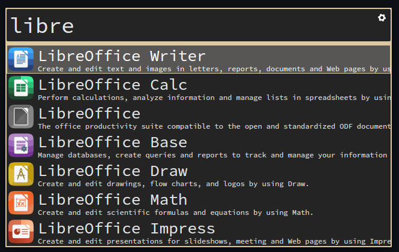

# gruvbox-theme-albert

GruvBox theme for the albert launcher.

<https://github.com/Fausto-Korpsvart/Gruvbox-GTK-Theme>

<https://github.com/albertlauncher/albert>

## Dark


## Light


## Installation
Add `GruvBox Dark.qss`/`GruvBox Light.qss` to:

`~/.local/share/albert/themes/`

or 

`/usr/share/local/albert/themes/`

```
 __________________
< Have a nice day! >
 ------------------
        \   ^__^
         \  (oo)\_______
            (__)\       )\/\
                ||----w |
                ||     ||
```

# Credits

Basically stole from https://github.com/will8211/adapta-theme-albert


